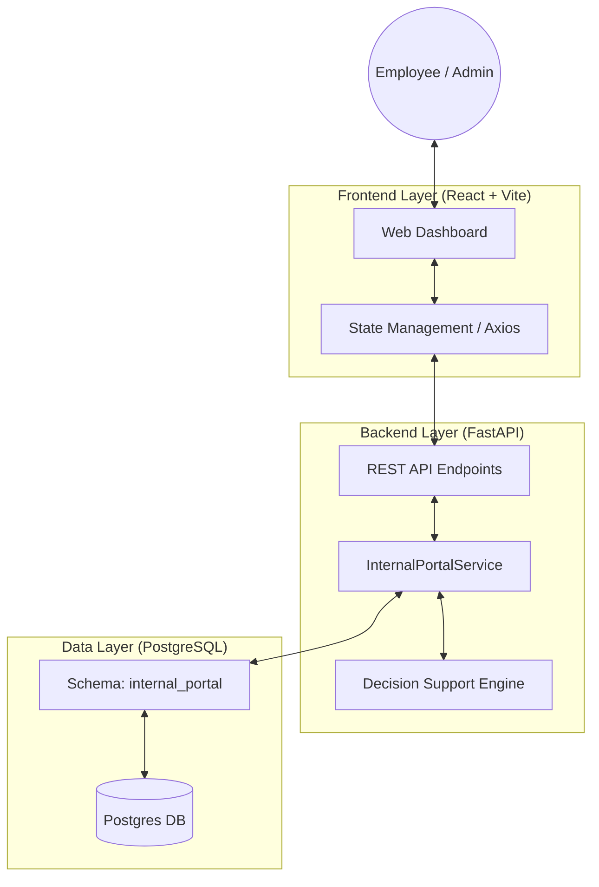

# Nexus: Enterprise Internal Operations Portal

Nexus is a full-stack internal operations platform designed to streamline employee engagement, feedback management, and real-time operational tracking. The system features an automated **Decision Support Engine** for handling employee complaints and a data-driven dashboard for administrative insights.

## 🏗 Architecture & Engineering Decisions

### System Architecture


### 1. Database & Schema Strategy
- **Multi-Schema Design**: Implements logical separation within PostgreSQL using custom schemas (`internal_portal`). This ensures a clear boundary between core operational data and potential future integrations.
- **Medallion-inspired Processing**: Although a single-node setup, the data flows from raw submission (Bronze) to analyzed results (Gold) within the `Complaint` lifecycle, ensuring auditability of automated recommendations.

### 2. Backend Implementation (FastAPI)
- **Asynchronous Execution**: Leverages Python's `asyncio` and FastAPI's background tasks for non-blocking ETL processes and data seeding.
- **Robust Initialization**: Features a custom database initialization wrapper with retry logic to ensure stability in containerized environments (handling race conditions during DB startup).
- **Extensible Service Layer**: Business logic is decoupled into a dedicated `InternalPortalService`, following the Service Layer Pattern for better maintainability and testing.

### 3. Frontend & UX (React + Vite)
- **Modern Component Architecture**: Built with React and Vite for optimal build performance.
- **State Management**: Implements efficient data fetching and polling mechanisms to keep administrative dashboards updated in real-time.

## 🚀 Getting Started

### Prerequisites
- Docker & Docker Compose
- (Optional) Python 3.9+ & Node.js 18+ for local development

### Deployment via Docker (Recommended)
The easiest way to spin up the entire ecosystem (App + PostgreSQL) is using Docker Compose:

```bash
docker-compose up --build
```

Access the application at: `http://localhost:5173`

### Manual Setup

#### Backend
1. Create a virtual environment: `python -m venv venv`
2. Install dependencies: `pip install -r backend/requirements.txt`
3. Configure `.env` variables
4. Start the server: `cd backend && uvicorn app.main:app --reload`

#### Frontend
1. Install dependencies: `cd frontend && npm install`
2. Start development server: `npm run dev`

## 🛠 Tech Stack
- **Backend**: FastAPI (Python), SQLAlchemy ORM
- **Frontend**: React.js, Vite, Vanilla CSS (Custom Design System)
- **Database**: PostgreSQL 15
- **Infrastructure**: Docker, Docker Compose
